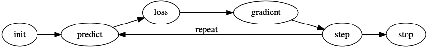

---
aliases:
- /education/fastai/2020/09/16/lesson-3
author: <a href='https://www.linkedin.com/in/tmbeck'>Tim Beck</a>
badges: true
categories:
- education
- fastai
comments: false
date: '2020-09-16'
description: Notes from Lesson 3 of fastai v4
keywords: fastai
layout: post
title: 'fastai v4: Lesson 3'
toc: true

---

# Lesson 3

Notes from fastai lesson 3, which is Chapter 4 in the book (the end of Ch. 2 is a "choose your own adventure" where you can continue on to Ch. 3, Data Ethics, or Ch. 4, Under the Hood: Training a Digit Classifier). The video lessons pick up at Ch. 4. But After reading much of Ch. 3, I find the Ethics to be an intriguing topic, especially for leaders of data science organizations, where failure to consider Data Ethics might put your organization (or at least its reputation) at risk.

## Links

* [Lesson 3 Video](https://course.fast.ai/videos/?lesson=3)
* [fastai Forum](https://forums.fast.ai/)
* [A visual intro to numpy and data representation](http://jalammar.github.io/visual-numpy/)

## Notes

### From Chapter 4

Covered images as arrays or tensors of pixels

Cool trick:

Visualizing greyscale images inside of a pandas df by specifying a background graident:

```python
im3_t = tensor(im3)
df = pd.DataFrame(im3_t[4:15,4:22])
df.style.set_properties(**{'font-size':'6pt'}).background_gradient('Greys')
```

#### Stop and Think

>...how a computer might be able to recognize these two digits. What kinds of features might it be able to look at? How might it be able to identify these features? How could it combine them?

This isn't a new topic for me as it overlaps with my *Signals & Systems* coursework, as well as DSP.

* Most straightforward: sum(A-B) = similarity score, identical images == 0
* The above, but after running through edge detection (first derivative)
* Use a kerneling function step-wise compare the outputs of the kernel function between the two systems

Measuring distance in vectors
* L1 norm / mean absolute difference: abs(A-B).mean()
    
    Use `F.l1_loss()`

* L2 norm / root mean square error (RMSE): sqrt(mean((A-B)^2))

    Use `F.mse_loss()`

When computing `mean()` with tensors, `mean()` can take an optional tuple argument that specifies the range of axes over which to compute the mean.

Much of this chapter covers an introduction to numpy and tensors. Vectors and matrices aren't new to me, and even slicing n-dimensional arrays is familiar (I have previous experience in perl and C). But I was struggling with this in python, e.g. the difference between `[:,:]` and `[:][:]`. I found this article by Jay Alammar very helpful: [A visual intro to numpy and data representation](http://jalammar.github.io/visual-numpy/) (thank you Jay!).

Stochastic Gradient Descent (SGD)



So far our primitive model is little more than a math function with no memory and no feedback. To do better we need to be able to train it and to make changes to a set of weights so as to alter the next outcome of the model.

Weights for each pixel. Could use the computed means as weights, where the flattened mean are weights.

Consider the simple function `def pr_eight(x,w) = (x*w).sum()` where `x`, `w` are vectors for the independent variables and the weights, respectively. How would we make this a machine learning "8" classifier?

1. Need to init(w) - seeded rand()?
2. For each image in our set, compute `x*w` e.g. make a prediction.
3. Compute the loss of the model (actual vs. expected)
4. Compute the gradient: a measure of change for each weight that changes the loss
5. Update the weights
6. `goto` 2. until some condition (e.g. the model is good)

Initialize

Start with random. How would random compare against the `mean()` though?

Loss

The convention is that small loss == good, big loss == bad. So we want a function that will measure ourselves as such.

Step

This is a change to the weight that results in a new prediction. Weights can go up or down. Mentions using gradients (calculus). But not clear how to avoid things like local minimums...

Stop

How we know when to stop - e.g. such as when our model begins to get worse at its job.

#### Gradients

* Gradients are a (continuous? since you must take at least the first derivative) function (used the quadratic y=x**2) with a local minimum (since there's a stopping point where y'==0?). It's also symmetric around an axis.
* A random value on the line is chosen (some x) as the initial value
* pytorch provides the `backward()` function to compute the gradient of a layer (array) of a network. This is the *backward pass* through the network. The *forward pass* is where the activation function is calculated.
* This is all handled through object-oriented "magic" in pytorch.
* stepping is done by altering the weights by your learning rate (`lr`) * the gradient of your weights. Recall that `1e-5` is a common rate.
* Takeaway: the gradient is a search for a local minimum. Step size through this search is the learning rate. This is done by backpropagating the affect of a function to a tensor's gradient. In this sense, "all the points" in our array are somewhere on this line and we wish to find a tensor such that the sum of the gradients is closest to zero. Think I said that correctly.

Application:

Let's apply the above to our MNIST imageset...

## Questionnaire

1. What letters are often used to signify the independent and dependent variables?

    x for the independent variable and y for the dependent variable, as in math, e.g. `y = f(x)`.

2. What's the difference between the crop, pad, and squish resize approaches? When might you choose one over the others?

    Crop trims image to size, pad adds zeros (black) to size, squish alters the aspect ratio to size. The choice depends on the data and the subject. It may be advantageous for the model to recognize half a bear, such as if trim is used.

3. What is data augmentation? Why is it needed?

    Data augmentation provides a broader view of material to train on. It can be a way to diversify the training set the model is based on.

4. What is the difference between item_tfms and batch_tfms?

    `item_tfms` operates on each item in a batch while `batch_tfms` operates on each batch.

5. What is a confusion matrix?

    A confusion matrix describes the predictions of the model, showing both where it is right vs. where it is wrong. It is shown as a table where x and y are your labels/categories and each cell is the number of images predicted vs. actually labeled.

6. What does export save?

    Export saves the labels, weights, and biases of the model for use on another system, e.g. to deploy to production.

7. What is it called when we use a model for getting predictions, instead of training?

    This is called inference.

8. What are IPython widgets?

    Controls that couple python, javascript, and html into a functional GUI within a jupyter notebook.

9. When might you want to use CPU for deployment? When might GPU be better?

    For inference (e.g. use in production), a CPU is likely sufficient, however for models deployed at scale, a GPU may be faster.

10. What are the downsides of deploying your app to a server, instead of to a client (or edge) device such as a phone or PC?

    1. It requires online access
    2. It is limited by the latency and bandwidth available of the underlying network
    3. It requires centralized resources (e.g. the server it runs on)

11. What are three examples of problems that could occur when rolling out a bear warning system in practice?

    1. It could be fooled by costumes or may not recognize partial bear images
    2. It might not know how to recognize all bears
    3. If online, requires internet connectivity, if offline, it requires updates

12. What is "out-of-domain data"?

    Data shown to a model that is unlike anything it was trained on

13. What is "domain shift"?

    Where the data our model is shown in production changes over time, diverging from what it was trained on. To resolve this, online training or simply retraining are used.

14. What are the three steps in the deployment process? *This is question 27 in Chapter 2 of fastbook*

    1. Create (train) the model
    2. Export the model
    3. Deploy the model for inference

15. How is a grayscale image represented on a computer? How about a color image?

    Grayscale images are represented as an array of 8-bit values. Color images (at least RGB colorspaced) are represented as a tuple/vector of three 8-bit values. For example, the shape of a greyscale image that is 28 pixels by 28 pixels would be (28, 28) and a color image (28, 28, 3).

16. How are the files and folders in the MNIST_SAMPLE dataset structured? Why?

    The data set has been pre-separated into a training set and a validation set. In each dataset, directories for each numeral contain images of that numeral.

17. Explain how the "pixel similarity" approach to classifying digits works.

    The "pixel similarity" approach used an average of all images of a numeral to create a baseline to compare new numeral images against. This can be done, say, by subtracting the sample image from the average and then using the result to compute an error vector, such as by taking the L1 normal (abs() of the difference minus the mean()).

18. What is a list comprehension? Create one now that selects odd numbers from a list and doubles them.

    List comprehension is a feature of the python language that returns a list from a some function. For example
    
    `doubles = [ (x*2) for x in range(1, 100, 2) ]`

    Returns a list containing the double of each odd number from 1 up to 100. 

19. What is a "rank-3 tensor"?

    A rank-3 tensor is a matrix. Recall that a rank-0 tensor is a scalar and a rank-1 tensor is a vector.

20. What is the difference between tensor rank and shape? How do you get the rank from the shape?

    A tensor shape describes the length of a tensor in each of its dimensions. The rank describes the number of dimensions. The rank can be computed as:

    `rank = len(t.shape)`

21. What are RMSE and L1 norm?

    L1 norm is the mean absolute distance: abs(A-B) - mean(A-B)
    L2 norm is the root mean square average: (A-B)**2.mean().sqrt()

22. How can you apply a calculation on thousands of numbers at once, many thousands of times faster than a Python loop?

    Using matrix math in numpy or tensors in pytorch.

23. Create a 3×3 tensor or array containing the numbers from 1 to 9. Double it. Select the bottom-right four numbers.

    ```python
    (t.tensor(range(1,10)).reshape(3, 3)*2)[1:3,1:3]

    tensor([[10,  12],
             16, 18]])
    ```

24. What is broadcasting?

25. Are metrics generally calculated using the training set, or the validation set? Why?

26. What is SGD?

    SGD is stochastic gradient descent. 

28. Why does SGD use mini-batches?

    We can more quickly compute new parameters with smaller steps. These smaller steps are mini-batches. They are less accurate than running the full batch, but faster. They are also more likely to be runnable on GPU accelerated systems, where memory is limited.

29. What are the seven steps in SGD for machine learning?

    1. init: Initialize our weights
    2. predict: For a given weight, predict the next value
    3. loss: Compute the loss from our prediction
    4. gradient: Compute the gradient for how much our loss would change for a small change to a weight
    5. step: Update our weight
    6. repeat: return to predict to continue the process
    7. stop: cease learning

30. How do we initialize the weights in a model?

31. What is "loss"?

    Loss is a computation of how good the model is doing by measuring predictions vs. actuals.

32. Why can't we always use a high learning rate?

    If the model learns too quickly it will pass or oscillate around the optimal weights. Also, if the learning rate is too high, we may overfit our model.

33. What is a "gradient"?

    A gradient is a computation of how much our loss would change by making a small change to a weight.
